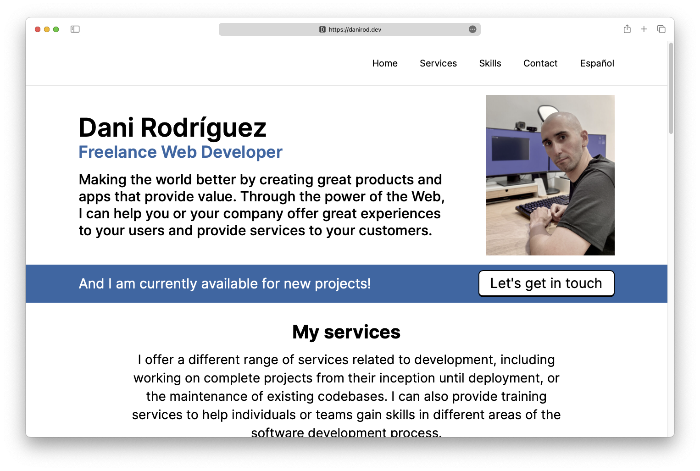

<figure>

</figure>

# danirod.dev

Yes, I made a new portfolio website for my freelance services. Features include:

- Not based on WordPress (I guess that is a feature for some).
- Multilingual, serves content both in English and in Spanish.
- New domain, to keep the SEO clean (danirod.es can be a digital garden again).

Powered by Nuxt 3 and UnoCSS.

## Commands

- Setup: `npm install`
- Run the server: `npm run dev`
- Build the app: `npm run build`
- Test in production: `npm run preview`

## Development notes

### Contact form

It uses an integration against Mailgun. There is a server endpoint in
/server/api/contact.post.ts which will receive the payload from the contact form
and deliver it via their REST API. Here are some important remarks.

#### Non-XHR fallback

**It is important that the contact form does content negotiation, period**. I've
seen a couple of times an unhandled exception inside the Nuxt internals that
causes all the JavaScript of the site to stop working and handling events, so
this is a real threat.

Pressing "Send" and not having the form submitted is unacceptable, which means
that the form requires proper `action` and `method` parameters so that if the
JavaScript event handler fails, it does a standard HTTP POST submit like in the
good old times.

It is important that the AJAX request sets the `Accept` header to
`application/json`, because that is what the backend endpoint will use to detect
if this is a XHR request or not. XHR requests will receive a JSON body as this
is what the Accept header asks. If it's not an XHR request, the endpoint will
302 to contact/success.vue, which presents a fairly traditional and boring
confirmation message.

#### Environment

The following four environment variables must be declared and present:

- `MAILGUN_API_KEY`: An API key to use Mailgun's REST API in order to deliver
  contact forms.
- `MAILGUN_API_DOMAIN`: The domain to use when sending an e-mail. Might be
  danirod.dev, might be the sandbox domain.
- `MAILGUN_API_FROM`: Just a way to parameterize the email to show in the From
  header, usually noreply@danirod.dev, but not hardcoded anyway.
- `MAILGUN_API_TO`: Just a way to parameterize the email where the contact form
  will be delivered, usually my business mail, but not hardcoded anyway.

### i18n

Situation:

- Spanish is configured at https://danirod.dev/es
- English is configured at https://danirod.dev/en
- Visiting either one of both should provide the contents in the given language.
- Visiting https://danirod.dev should 302 to the appropiate language based on
  the Accept-Language header.

Additional requirements (should be covered by nuxt-i18n but it is important to
take a look):

- Make sure that the html tag has the proper lang="" attribute.
- Make sure that there are hreflang references in the head.
